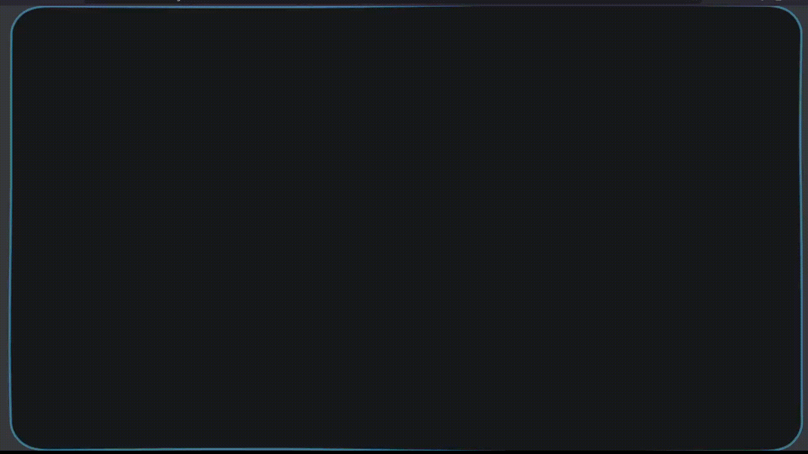

# Full-Screen Rounded Audio Visualizer
A minimal, single-file **full-screen audio visualizer** built with Web Audio API and Canvas.

It renders a rounded rectangle frame that reacts in real-time to audio input - edges distort outward along normals with differentiated side responses (vertical sides for mid/low freq, top for high, bottom for low). Clean, tense, and embed-friendly.

No sound input:


Sound input:


**Key Features**
- Single HTML file — zero dependencies, no frameworks
- Full-screen + transparent background — ideal for `<iframe>` embedding
- Microphone input (or system audio via loopback/virtual cable)
- Easy customization via a central `CONFIG` object
- Great for: live stream backgrounds, OBS browser sources, desktop wallpapers, website overlays, party projections, etc.

## Quick Start

1. **Run locally**  
    Clone or download the repo -> double-click `index.html` -> allow microphone access in the browser.

2. **Use system audio**  
    Simply you can choose the `Monitor of <your output device>` if there is, or a complex way - you should setup a virtual audio cable

3. **Embed in a webpage or iframe**  
   ```html
   <iframe 
     src="<the path or url to index.html>"
     allow="microphone"
     style="border:none; width:100%; height:100vh; overflow:hidden;"
   ></iframe>